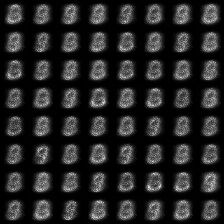

# GAN
Tensorflow implementation of some GANs.

## Results for mnist
The following results can be reproduced with command:  
```
python main.py --model <TYPE>
```

*Name* | *Epoch 1* | *Epoch 10* | *Epoch 25* |
:---: | :---: | :---: | :---: |
GAN |  |  |  |
DCGAN |  |  |  |
CDCGAN |  |  |  |
WGAN |  |  |  |

## Acknowledgements
This implementation has been tested with Tensorflow over ver1.3 and Python3 on Windows 10.